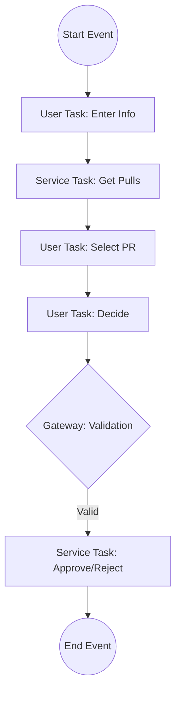

# Camunda and BPMN: PR Review Workflow PoC

## Overview

### Camunda

**Camunda** is a platform used to design, execute, and monitor business processes and workflows. It is commonly used in microservices architectures and enterprise systems to orchestrate complex processes.

### BPMN (Business Process Model and Notation)

**BPMN** is a graphical standard for modeling business processes. It provides a visual language that both technical and non-technical users can understand.

#### Key BPMN Elements

- **Events**: Start, intermediate, end
- **Tasks**: Work units
- **Gateways**: Decision points
- **Flows**: Sequence and message flows

---

## Workflow Process

1. **Design**: Create the workflow in BPMN using Camunda Modeler.
2. **Deploy**: Deploy the model to the Camunda engine.
3. **Execute**: The engine executes process logic based on the model.
4. **Monitor/Optimize**: Track performance and refine via dashboards.

### What the Workflow Graph Represents

- **Human Tasks**: e.g., Code review.
- **Decision Logic**: e.g., Approve or Reject.
- **Automated Actions**: e.g., Running a CI/CD pipeline.

---

## PoC: BPMN-Driven GitHub PR Review

This Proof of Concept (PoC) implements a BPMN-driven workflow that orchestrates a **GitHub Pull Request Review** using Camunda and the GitHub API.

### Objective

Automate and structure the pull request review process by combining:

- **User Input**: GitHub tokens, repository details.
- **Dynamic Data Retrieval**: Fetching the PR list.
- **Human Decision**: Manual approval, requested changes, or comments.
- **Automated Execution**: Submitting the review via API.

### Workflow Visualization (V1)



---

## Detailed Steps

### 1. Start Event & Initial Input

- **Activity**: User Task (Manual trigger)
- **Inputs Required**:
  - `githubToken`: Personal Access Token.
  - `owner`: Repository owner.
  - `repo`: Repository name.

### 2. Service Task: Get Pulls

Calls the GitHub API to fetch open pull requests.

- **Endpoint**: `GET /repos/{owner}/{repo}/pulls`
- **Output Storage**:
  - `prs`: Raw response data.
  - `prOptions`: Mapped list for the UI dropdown.

### 3. User Task: Select PR

- **Action**: User selects a PR from a dropdown populated by `prOptions`.
- **Output**: `PR_ID`

### 4. User Task: Decide

The reviewer provides their verdict.

- **Inputs**:
  - `decision`: `approve` | `request_changes` | `comment`
  - `comment`: Conditional text (required if requesting changes).

### 5. Gateway: Validation

Ensures compliance before proceeding.

- **Condition**: If `decision == "request_changes"`, then `comment` must not be empty.
- **Action**: If invalid, loops back to the **Decide** task.

### 6. Service Task: Approve/Reject

Submits the final review to GitHub.

- **Endpoint**: `POST /repos/{owner}/{repo}/pulls/{PR_ID}/reviews`
- **Payload Example**:

```json
{
  "event": "APPROVE",
  "body": "Great work! LGTM."
}
```
